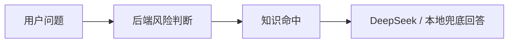
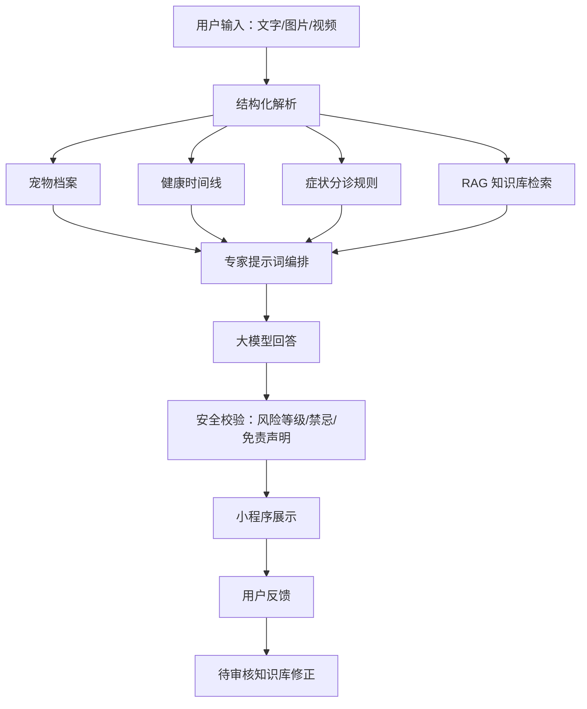

# 宠小护产品、AI 与小程序 UI/UX 深度诊断

日期：2026-04-29  
角色视角：资深全栈工程师 + 资深产品经理 + 宠物健康顾问  
项目定位：面向中国宠物主的“AI 养宠管家 + 健康记录 + 风险分诊 + 提醒”微信小程序。

## 结论先说

宠小护现在处于“功能原型已经跑通，但还没有形成可留存产品”的阶段。

你现在的问题不是单纯“页面丑”，而是三个层面叠在一起：

1. 产品主线还不够清楚：用户打开小程序后，不知道宠小护最重要的价值是“问 AI”“记健康”“提醒喂饭遛狗”“判断要不要就医”中的哪一个。
2. AI 还不够像专家：目前有宠物档案和健康记录上下文，但还缺少知识库、病例时间线、图片/视频、追问策略、反馈纠错和长期健康洞察。
3. UI/UX 缺少统一设计系统：页面有很多卡片、渐变、圆角、阴影、固定底栏、顶部自定义导航，但信息层级、间距、安全区、状态反馈、组件规范还没有统一。

1.0 不建议继续堆很多零散功能。应该先把宠小护做成一个清晰闭环：

> 建档案 → 设日常计划 → 记录健康 → AI 根据档案和记录分析 → 给出风险等级和行动建议 → 生成就医摘要 → 用户反馈纠错 → 知识库持续完善

## 竞品观察

我参考了当前宠物健康/AI 宠物产品的公开功能介绍，发现成熟产品并不是只做“问诊聊天”，而是围绕“宠物长期健康管理”组织功能。

### Clawmate

来源：[Clawmate](https://clawmate.com/)

它强调 AI companion，不只做问答，还包括：

- 宠物健康追踪。
- 智能提醒。
- 照片/视频上传后的情绪或健康分析。
- 多宠物支持。
- 免费版/付费版分层。

对宠小护的启发：AI 聊天应该只是入口之一，首页必须把“健康状态、提醒、记录、AI 洞察”放在同一张日常面板里。

### CanopyVet

来源：[CanopyVet](https://www.canopyvet.com/)

它的核心是“AI 症状检查 + 远程兽医 + 健康记录 + 提醒”。用户不是为了聊天而聊天，而是在担心时快速知道：

- 是否紧急。
- 是否需要联系兽医。
- 需要准备什么信息。
- 如何保存和分享健康记录。

对宠小护的启发：分诊页必须比 AI 聊天更结构化，要问持续时间、精神、食欲、饮水、排尿、排便、误食、照片/视频等，而不是只让用户输入一句话。

### PetCare AI / Pet Health IQ

来源：[PetCare AI App Store](https://apps.apple.com/us/app/petcare-ai-pet-health-tracker/id6749845164)、[Pet Health IQ App Store](https://apps.apple.com/us/app/pet-health-iq/id6759101613)

它们突出：

- 拍照健康扫描。
- 根据品种、年龄、历史记录生成建议。
- 体重和健康趋势追踪。
- 毒物/食物安全查询。
- 提醒。

对宠小护的启发：你后面要做的不是“训练一个全能大模型”，而是用结构化宠物资料 + 健康记录 + RAG 知识库 + 多模态输入，让模型更像一个懂上下文的宠物健康助理。

### PetGuard AI

来源：[PetGuard AI](https://petguardai.com/)

它把“安全”做得很重，包括：

- 植物扫描。
- 食物安全。
- 症状检查。
- 健康仪表盘。
- 紧急联系人。

对宠小护的启发：中国用户也高频关心“这个能不能吃”“误食怎么办”“尿不出来是不是急症”。1.0 应该加入“食物/毒物速查”和“急症红灯库”。

### Buddydoc

来源：[Buddydoc](https://www.buddydoc.io/)

它的主功能包括：

- 症状检查。
- 远程问诊。
- 预约和提醒。
- 医疗记录。
- 食物字典。
- 日记。

对宠小护的启发：日记/记录不是附属功能，而是让 AI 变聪明的燃料。记录做得越顺手，AI 回答越个性化。

### Petto Health

来源：[Petto Health Medical Records](https://www.petto.health/features/medical-records/)

它强调统一健康仪表盘、疫苗/药物/病史记录、自动提取医疗文档、智能提醒、多宠物和共享。

对宠小护的启发：后续可以做“拍照上传疫苗本/化验单/病历，AI 自动整理成结构化档案”，这会比普通聊天更有壁垒。

## 当前项目阶段判断

### 已经具备的基础

项目已经不是空壳，核心骨架已经有：

- 微信小程序端。
- 首页。
- AI 助手页。
- 健康记录页。
- 宠物档案页。
- 症状分诊页。
- 餐食建议页。
- 提醒页。
- 就医摘要页。
- 后端 AI 接口。
- 本地宠物档案和健康记录上下文。
- docs 产品规划文档。

这是一个“可演示原型”，但还不是“可正式上线 MVP”。

### 现在还不够上线的原因

1. 页面功能之间还像散点，没有形成强闭环。
2. AI 能回答，但缺少可信来源、结构化追问和长期记忆。
3. UI 看起来每页都在单独设计，没有统一组件规范。
4. 提醒还没有微信订阅消息，不能真正提醒用户。
5. 图片/视频分析还没有接入，只能文字输入。
6. 健康趋势页还偏静态，没有真正用记录生成趋势。
7. 多宠物、家庭共享、数据备份、云端同步还没有。
8. 宠物医疗建议存在合规边界，需要更明确的安全策略。

## 产品问题诊断

### 1. 功能看起来单一

表面原因：用户主要看到 AI 问答和几个入口。

深层原因：功能没有围绕一个“每日养宠工作台”组织。

应该改成：

- 首页不是展示卡片，而是回答“今天我该做什么？”
- AI 不是孤立聊天，而是“基于档案 + 记录 + 知识库的宠物助理”。
- 健康记录不是表单，而是“AI 分析的原材料”。
- 提醒不是一个列表，而是“喂饭、遛狗、驱虫、疫苗、复诊、用药”的可执行计划。

### 2. AI 不够智能

当前 AI 的问题：

- 对话没有长期病例时间线。
- 没有根据用户输入动态追问。
- 没有图片/视频分析。
- 没有真正的知识库版本管理。
- 没有用户反馈后的知识库修正流程。
- 没有把症状分诊结果、健康记录、就医摘要联动起来。

应该补的 AI 能力：

- 结构化追问：按症状类型追问关键问题。
- 风险分级：红/黄/绿三色必须稳定、保守。
- RAG 检索：引用知识库片段，不靠模型裸猜。
- 多模态：图片看皮肤、眼睛、便便、呕吐物、伤口；视频看步态、咳嗽、呼吸、抽搐。
- 长期洞察：最近 7/30 天食欲、饮水、排便、体重、精神变化。
- 反馈学习：用户点“不准”后进入后台审核，不要直接污染知识库。

### 3. 缺少高频养宠工具

1.0 应该补齐这些轻工具：

- 喂食计算器：按体重、年龄、绝育、活动量、主粮热量估算。
- 换粮计划：7 天过渡比例。
- 食物安全速查：葡萄、巧克力、洋葱、百合、人药等。
- 疫苗/驱虫计划：猫狗模板。
- 便便/呕吐/尿液记录：支持照片。
- 体重趋势：折线图 + 异常提醒。
- 复诊/用药提醒。
- 就医摘要一键复制。

### 4. 缺少商业闭环

低预算个人项目，先不要急着做商城和医院系统。更合理的商业路径：

- 免费版：1 只宠物、有限 AI 次数、基础提醒。
- 会员版：多宠物、更多 AI 次数、长期健康趋势、图片分析、就医摘要。
- 专业版：兽医审核内容、复诊提醒、病历上传整理。
- 后续变现：用品导购、保险导流、医院合作，但必须等用户信任建立后再做。

## UI/UX 问题诊断

这里结合本地 `ui-ux-skills` 的规则、当前代码，以及微信小程序特性做判断。

### 1. 信息层级混乱

当前首页同时出现：

- 顶部导航。
- 大 hero。
- 健康摘要。
- 快捷入口。
- 今日任务。
- 悬浮按钮。
- 底部导航。

这些组件都有视觉重量，导致用户第一眼不知道该点哪里。

建议首页视觉优先级：

1. 今日状态：宠物、健康分、下一项提醒。
2. 紧急入口：急症/误食/尿闭等。
3. AI 洞察：基于最近记录的一句话建议。
4. 今日计划：喂饭、饮水、遛狗、用药。
5. 快速记录：作为底部浮层或固定快捷栏。

### 2. 自定义顶部导航和页面 padding 冲突

小程序用了 `navigationStyle: custom` 后，页面从屏幕顶部开始渲染。顶部导航必须自己处理状态栏、胶囊按钮和安全区。

当前 `TopBar` 已经计算了 `statusBarHeight` 和胶囊，但页面自身又有 `padding: 0 24rpx`，容易让导航栏、内容区、顶部间距在不同页面表现不一致。

建议：

- 所有页面根节点不加横向 padding。
- 统一使用 `.page-content` 控制内容区左右边距。
- `TopBar` 始终全宽。
- `TopBar` 只负责导航，不要被页面布局影响。

微信小程序自定义导航栏需要根据状态栏和胶囊位置动态计算高度，公开资料也反复强调模拟器和真机可能不一致，不能写死高度。参考：[自定义导航栏安全区说明](https://blog.csdn.net/qq_40167860/article/details/141714778)、[小程序自定义导航栏实现](https://leejim.github.io/miniprogram/custom-navigator.html)。

### 3. 底部导航应该原生化或规范化

当前 `BottomNav` 是每页手动引入组件，然后用 `redirectTo` 切换页面。

问题：

- 页面栈容易混乱。
- 子页面返回和一级页切换体验不统一。
- 微信小程序底部导航在真机上可能出现安全区和遮挡问题。

建议二选一：

方案 A：使用小程序原生 `tabBar`。适合 1.0，稳定。

方案 B：使用微信规范的 `custom-tab-bar`。适合后续做更强品牌化，但要按小程序要求放在 `custom-tab-bar` 目录，并配合 `tabBar.custom = true`。

底部一级导航建议 4 个：

- 今日
- AI
- 记录
- 我的

不要把“急症”放底部导航。急症应该作为顶部/首页固定紧急入口。

### 4. 颜色系统不稳定

当前主色是暖橙，辅色是薄荷绿，风险色是红黄绿，这个方向是对的。但代码里大量组件直接写 hex，造成：

- 后续换主题困难。
- 不同页面色值微妙不一致。
- 风险色、品牌色、信息色容易混用。

建议设计系统：

- 品牌主色：暖橙，用于主要 CTA 和亲和感。
- 健康色：薄荷绿，用于健康、完成、正常状态。
- 风险红：只用于急症、危险、删除。
- 警示黄：用于观察、提醒、待确认。
- 信息蓝：用于摘要、记录、趋势。
- 背景色：保留米白，但不要全页面都是卡片。

注意：本地 UI skill 给出的 claymorphism 方向偏“软萌”，但宠小护有医疗风险判断属性，不能做得太玩具化。建议使用“温暖、可信、轻医疗”的风格，而不是过度糖果、过度 3D、过多渐变。

### 5. 卡片太多，页面变碎

现在很多内容都包成卡片，卡片内又有卡片感。这样会导致：

- 视觉噪音变高。
- 页面缺少呼吸感。
- 用户无法判断哪些是主要操作。

建议：

- 首页只保留 2-3 个强卡片：今日状态、AI 洞察、今日计划。
- 快捷入口用横向功能条或 2x2 操作区，不要每个都重卡片。
- 表单页用分组区块，不要卡片套卡片。
- 记录列表用轻量 list item，减少阴影。

### 6. 文字和图标风格不统一

代码里还有 emoji 作为情绪符号，局部页面又用 SVG IconAtom。结构性功能应该全部用统一图标，不建议把 emoji 当导航/按钮图标。

可以保留少量情绪化文案，但不要让 emoji 承担信息识别。

### 7. 表单流程不够宠物健康专业

症状分诊现在还是“选择症状 + 补充描述”，但不同症状需要不同追问：

- 呕吐：次数、颜色、是否有血、是否误食、能否饮水、精神状态。
- 腹泻：次数、便血/黑便、是否幼宠、是否换粮。
- 排尿异常：是否完全尿不出、频繁蹲、叫声、尿血。
- 呼吸异常：频率、舌色、是否张口呼吸。
- 皮肤问题：部位、范围、是否瘙痒、是否脱毛、是否渗出。

建议用“动态分诊表单”，而不是一个通用 textarea。

### 8. 缺少状态反馈

应该补齐：

- 保存成功 toast。
- 网络失败重试。
- AI 请求超时提示。
- 表单必填错误。
- 空状态下一步。
- 图片上传进度。
- 订阅消息授权状态。

### 9. 多设备适配不足

需要重点检查：

- iPhone 刘海屏。
- iPhone 小屏。
- Android 高状态栏。
- 微信开发者工具模拟器。
- 真机预览。
- 横屏。

验收标准：

- 顶部内容不贴状态栏。
- 底部按钮不被手势条遮挡。
- 输入框弹键盘后不遮挡发送按钮。
- 长文 AI 回答可滚动，不挤压底部导航。
- 子页面有稳定返回按钮。

## 建议的 1.0 页面结构

### Tab 1：今日

目标：用户每天打开小程序，知道今天该做什么。

结构：

1. 顶部宠物切换：头像、名字、年龄、体重、健康状态。
2. 今日一句话：AI 根据最近记录生成提醒。
3. 高优先级提醒：用药、复诊、驱虫、疫苗、异常观察。
4. 今日计划：喂饭、饮水、遛狗、互动、记录。
5. 快速记录：进食、饮水、便便、排尿、呕吐、精神。
6. 急症入口：固定红色小入口。

### Tab 2：AI

目标：把它做成“专家助理”，不是普通聊天。

结构：

1. 顶部显示当前宠物和上下文状态。
2. 三个模式入口：
   - 日常养护
   - 症状分诊
   - 餐食营养
3. 输入区支持：
   - 文字
   - 图片
   - 视频
   - 选择最近记录
4. 回答结构固定：
   - 风险等级
   - 判断依据
   - 现在能做什么
   - 何时必须就医
   - 需要补充的问题
   - 引用来源
5. 反馈按钮：
   - 有帮助
   - 不准确
   - 风险判断有问题
   - 补充知识

### Tab 3：记录

目标：让用户愿意每天轻量记录。

结构：

1. 快速记录九宫格。
2. 时间线。
3. 趋势：体重、食欲、饮水、便便、排尿、精神。
4. 图片记录：皮肤、眼睛、便便、呕吐物、伤口。
5. 就医摘要入口。

### Tab 4：我的

目标：宠物档案、提醒、知识库反馈、设置。

结构：

1. 多宠物档案。
2. 疫苗/驱虫/慢病/过敏。
3. 提醒模板。
4. 数据导出。
5. AI 设置。
6. 隐私与免责声明。

## 功能优先级

### P0：先让产品像一个完整小程序

1. 重构小程序导航：一级页统一底部 Tab，子页统一返回。
2. 重构首页：变成“今日养宠工作台”。
3. 统一页面容器：解决顶部安全区、底部安全区、页面 padding。
4. 统一组件 token：颜色、字号、圆角、阴影、间距。
5. 健康记录和 AI 完全打通。
6. 提醒本地可用，至少支持喂饭、遛狗、驱虫、疫苗、用药。
7. 就医摘要能自动带出最近记录。

### P1：让 AI 变得明显更聪明

1. 动态分诊表单。
2. RAG 知识库。
3. 用户反馈后台。
4. 图片分析入口。
5. 食物/毒物速查。
6. 体重和健康趋势分析。
7. AI 每日一句健康洞察。

### P2：上线后增强

1. 多宠物。
2. 云同步。
3. 微信订阅消息。
4. 家庭共享。
5. 病历/疫苗本 OCR。
6. 兽医审核后台。
7. 会员计费。
8. 医院/用品/保险合作。

## AI 系统应该怎么升级

### 当前架构

当前更像：



### 目标架构

应该升级为：



### 关键原则

不要把用户反馈直接写进知识库。宠物医疗类内容必须审核，否则会越学越危险。

正确流程：

1. 用户反馈回答不准。
2. 保存原问题、宠物档案、AI 回答、用户反馈。
3. 后台标记为待审核。
4. 人工或兽医审核后形成知识条目。
5. 知识条目带来源、风险等级、适用物种、更新时间。
6. 通过 RAG 进入后续回答。

### 知识库分类

建议先做这些分类：

- 急症红灯：尿闭、呼吸困难、中毒、抽搐、昏迷、难产、大出血。
- 猫常见问题：呕吐、腹泻、泌尿、皮肤、眼耳口腔。
- 狗常见问题：呕吐、腹泻、跛行、皮肤、误食、呼吸。
- 饮食营养：喂食量、换粮、肥胖、绝育后饮食。
- 食物安全：可吃/慎吃/禁吃。
- 疫苗驱虫。
- 日常护理。
- 行为和训练。
- 就医准备。

## 图片/视频分析怎么做

不要一开始承诺“拍照诊断”。更安全的表达是：

> 图片/视频仅用于辅助识别可见异常和整理就医信息，不能替代兽医检查。

### 图片适合做

- 皮肤红肿、掉毛、伤口。
- 眼睛分泌物。
- 耳朵脏污。
- 便便形态。
- 呕吐物。
- 体型胖瘦。
- 疑似误食物品。

### 视频适合做

- 咳嗽。
- 呼吸状态。
- 跛行。
- 抽搐。
- 精神状态。
- 走路异常。

### 多模态回答必须有边界

模型只能说：

- “从图片看可能存在……”
- “建议补充……”
- “出现这些情况请立即就医……”

不能说：

- “确诊为……”
- “吃某某药多少剂量……”
- “不用去医院……”

## 推荐 UI 设计系统

### 设计风格

关键词：温暖、可信、轻医疗、日常管家、低焦虑。

不建议：

- 过度卡通。
- 过度糖果色。
- 大面积渐变。
- 卡片套卡片。
- 大量装饰圆点和漂浮元素。
- 每页都不一样的视觉语言。

建议：

- 背景：米白或浅灰暖底。
- 主要操作：暖橙。
- 健康状态：薄荷绿。
- 风险：红黄绿明确分级。
- 页面尽量用分组和列表，而不是堆满重卡片。
- 图标统一线性风格。
- 按钮高度至少 72rpx。
- 可点击区域至少 88rpx 高或 88rpx 宽。

### 颜色建议

保留现有暖橙 + 薄荷绿，但降低大面积暖橙的使用。

```text
Primary / 行动：#E8956E
Primary Dark：#D4784E
Health / 正常：#6AAA93
Health Soft：#EEF7F2
Warning：#E8B84F
Danger：#E87060
Info：#6A8FA0
Page：#FAF7F2
Surface：#FFFFFF
Text Main：#2D3436
Text Secondary：#66756A
Border：#E8E0D8
```

### 组件规范

#### TopBar

- 全宽，不受页面 padding 影响。
- 动态计算状态栏和胶囊。
- 左侧返回只在子页面出现。
- 右侧只放一个紧急按钮或状态。
- 标题不超过一行。

#### BottomNav

- 只服务一级页面。
- 4 个以内最佳，最多 5 个。
- 图标 + 文本同时展示。
- 当前页状态必须明显。
- 不要让内容被底栏遮住。

#### Card

- 普通卡片圆角 16-20rpx。
- 强卡片最多 1-2 个。
- 阴影要轻，列表项尽量用边框和背景，不要重阴影。

#### Button

- 一个页面只有一个主按钮。
- 危险按钮和主按钮分开。
- 禁用状态必须明显。
- 加载状态必须锁定重复点击。

#### Form

- 有固定 label，不只依赖 placeholder。
- 错误提示靠近字段。
- 多步骤分诊要保留返回。
- 长表单需要自动保存草稿。

## 建议的首页新布局

```text
┌──────────────────────────┐
│ TopBar：宠小护      急症 │
├──────────────────────────┤
│ 宠物状态卡：小橘         │
│ 健康指数 / 下一项 / 风险 │
├──────────────────────────┤
│ AI 今日洞察              │
│ 根据最近记录生成一句建议 │
├──────────────────────────┤
│ 快速操作                 │
│ 症状分诊 餐食 食物安全 摘要 │
├──────────────────────────┤
│ 今日计划                 │
│ 08:00 早餐               │
│ 12:30 饮水/活动           │
│ 18:30 晚餐               │
├──────────────────────────┤
│ 快速记录条               │
│ 进食 饮水 便便 排尿 更多 │
├──────────────────────────┤
│ BottomNav                │
└──────────────────────────┘
```

## 建议的 AI 页新布局

```text
┌──────────────────────────┐
│ TopBar：AI 助手  风险状态 │
├──────────────────────────┤
│ 当前上下文：小橘/猫/最近记录 │
├──────────────────────────┤
│ 模式切换：日常 症状 餐食   │
├──────────────────────────┤
│ 快捷问题 / 最近记录选择    │
├──────────────────────────┤
│ 对话区                    │
│ 回答卡：风险等级/建议/引用 │
├──────────────────────────┤
│ 输入：文字 + 图片 + 视频   │
└──────────────────────────┘
```

## 建议的记录页新布局

```text
┌──────────────────────────┐
│ TopBar：健康记录          │
├──────────────────────────┤
│ 今日快速记录              │
│ 进食 饮水 便便 排尿       │
│ 呕吐 精神 皮肤 体重       │
├──────────────────────────┤
│ 趋势摘要                  │
│ 体重 / 食欲 / 排便 / 饮水 │
├──────────────────────────┤
│ 时间线                    │
│ 记录项 + 照片 + 备注      │
└──────────────────────────┘
```

## 代码层面的主要问题

### 1. 样式 token 没有真正落地

`tokens.css` 有工具类，但组件里依然大量硬编码颜色、圆角和间距。后续应该把组件样式收敛到统一 token。

### 2. 一级导航不应该每页手动拼

现在 `BottomNav` 手动放在页面里，建议改成原生 tabBar 或规范 custom-tab-bar。

### 3. 页面容器重复

每个页面都自己写 `.page`、padding、背景、bottom padding，容易出现安全区不一致。

应该有统一页面壳：

- `AppPage`
- `PageContent`
- `SafeBottomSpacer`

### 4. AI 和业务数据仍是前端本地为主

本地记录适合 1.0 原型，但正式上线至少要有：

- 用户 openid。
- 宠物表。
- 健康记录表。
- 提醒表。
- AI 对话表。
- 反馈表。
- 知识库表。

### 5. 多模态缺后端链路

图片/视频不能只在小程序端选取，需要：

- 上传临时文件。
- 文件大小限制。
- 图片压缩。
- 后端鉴权。
- 模型调用。
- 敏感内容和医疗免责声明。
- 保存到健康记录或就医摘要。

## 后续实施路线

### 第 1 周：UI/UX 整体重构

目标：先让小程序看起来像一个统一产品。

任务：

1. 重构 `TopBar`，保证全页安全区统一。
2. 重构 `BottomNav` 为原生 tabBar 或规范 custom-tab-bar。
3. 建立统一页面容器组件。
4. 首页改成今日工作台。
5. AI 页改成模式化助手。
6. 健康记录页改成记录 + 趋势 + 时间线。
7. 移除多余装饰和过重卡片。

### 第 2 周：AI 专家感增强

目标：让用户明显感觉“它懂我家宠物”。

任务：

1. 症状分诊动态追问。
2. AI 回答强制结构化。
3. 最近记录进入回答依据。
4. 食物/毒物速查。
5. 就医摘要自动生成。
6. 用户反馈入库。

### 第 3 周：知识库与后台

目标：建立可信内容壁垒。

任务：

1. 知识库数据结构。
2. 管理后台增删改查。
3. 反馈审核流。
4. RAG 检索。
5. 引用来源展示。

### 第 4 周：上线准备

目标：能给真实用户试用。

任务：

1. 小程序 AppID 和合法域名。
2. 云端数据库。
3. API 部署。
4. 隐私政策。
5. 用户协议。
6. 医疗免责声明。
7. 埋点和错误日志。
8. 真机测试。

## 需要你提供或确认

1. 小程序 AppID。
2. 是否只做猫狗，还是支持兔子、仓鼠、鸟等。
3. 是否要接入图片/视频分析。
4. DeepSeek 或其他多模态模型具体型号。
5. 第一批知识库来源。
6. 是否有兽医或宠物师可以帮忙审核内容。
7. 是否要做会员付费。
8. 品牌偏好：更温暖可爱，还是更专业医疗。

## 最后建议

宠小护不要做成“宠物版 ChatGPT”。这个方向太容易被替代。

更好的方向是：

> 一个每天陪用户养宠的小程序：知道宠物是谁，记得它最近发生了什么，知道什么时候该吃饭、遛狗、驱虫、复诊，也能在用户焦虑时快速判断风险，并整理好给医生看的信息。

真正的壁垒不是模型本身，而是：

- 结构化宠物档案。
- 长期健康记录。
- 可审核知识库。
- 风险分诊规则。
- 用户反馈闭环。
- 清晰、可信、低焦虑的 UI/UX。

下一步应该优先做 UI/UX 重构和功能闭环，不要继续堆孤立页面。
